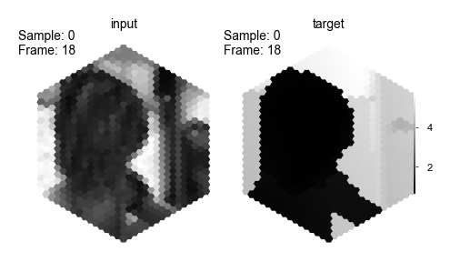
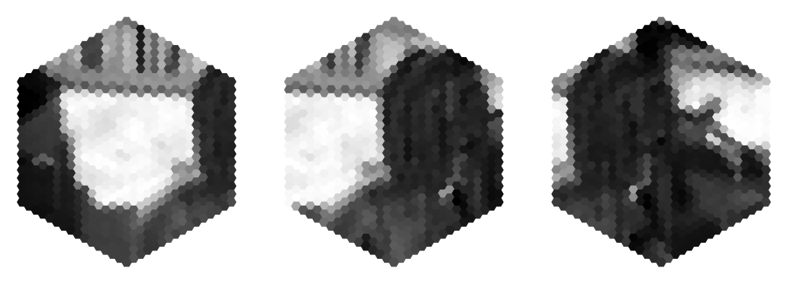
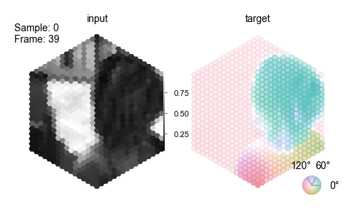
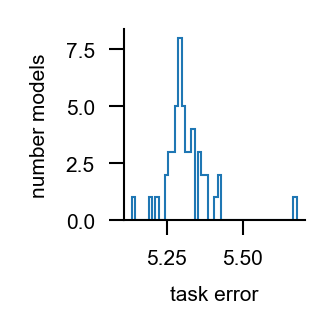

```
%load_ext autoreload
%autoreload 2
```

    The autoreload extension is already loaded. To reload it, use:
      %reload_ext autoreload


# Optic flow task


This notebook illustrates the optic flow task and how to use it with our pretrained fly visual system model and decoder.

**Select GPU runtime**

To run the notebook on a GPU select Menu -> Runtime -> Change runtime type -> GPU.


```
# @markdown **Check access to GPU**

try:
    import google.colab

    IN_COLAB = True
except ImportError:
    IN_COLAB = False

if IN_COLAB:
    import torch

    try:
        cuda_name = torch.cuda.get_device_name()
        print(f"Name of the assigned GPU / CUDA device: {cuda_name}")
    except RuntimeError:
        import warnings

        warnings.warn(
            "You have not selected Runtime Type: 'GPU' or Google could not assign you one. Please revisit the settings as described above or proceed on CPU (slow)."
        )
```

**Install Flyvis**

The notebook requires installing our package `flyvis`. You may need to restart your session after running the code block below with Menu -> Runtime -> Restart session. Then, imports from `flyvis` should succeed without issue.


```
if IN_COLAB:
    # @markdown **Install Flyvis**
    %%capture
    !git clone https://github.com/flyvis/flyvis-dev.git
    %cd /content/flyvis-dev
    !pip install -e .
```


```
# basic imports
import matplotlib.pyplot as plt
import numpy as np
import torch

plt.rcParams['figure.dpi'] = 200
```

# The Sintel dataset

We use the Sintel dataset to train out models as described in the paper. More infos about the Sintel dataset can be found on the official Sintel website: http://sintel.is.tue.mpg.de/.


```
import matplotlib.pyplot as plt
import numpy as np
from flyvision.datasets.sintel import MultiTaskSintel
from flyvision.analysis.animations.sintel import SintelSample

%load_ext autoreload
%autoreload 2
```

    The autoreload extension is already loaded. To reload it, use:
      %reload_ext autoreload


The class `MultiTaskSintel` loads, preprocesses, renders, and augments the sintel data. It adheres to the pytorch dataset primitive. It provides the interface to the input data and the output data for the flyvision networks. Note: the fly-eye rendering we use here, we introduce in the notebook on creating custom stimuli already.

This is the full setting:


```
dataset = MultiTaskSintel(
    tasks=["flow"],
    boxfilter=dict(extent=15, kernel_size=13),
    # Because the fly eye rendering is square
    # and sintel is wide, we can crop sintel
    # in width and render three sequences from one.
    # This allows us to statically augment our dataset
    # a bit already before we proceed with the random augmentations.
    # We end up with 3 * 23 sequences.
    vertical_splits=3,
    n_frames=19,
    center_crop_fraction=0.7,
    dt=1 / 50,
    augment=True,
    # From sequences with more than n_frames, we randomly sample the start frame.
    random_temporal_crop=True,
    all_frames=False,
    # We resample movie frames to the effective framerate given by 1/dt
    resampling=True,
    # We interpolate the flow arrows to 1/dt.
    interpolate=True,
    # We flip with equal probability (using one flip-axis).
    p_flip=0.5,
    # We rotate with equal probability (using five fold rotation symmetry of the hex-grid).
    p_rot=5 / 6,
    # We randomly adjust contrast and brightness.
    contrast_std=0.2,
    brightness_std=0.1,
    # We add random white noise pixelweise.
    gaussian_white_noise=0.08,
    gamma_std=None,
    _init_cache=True,
    unittest=False,
    flip_axes=[0, 1],
    task_weights=None,
)
```


```
# The `dataset.arg_df` tracks the sequence index, identity etc.
dataset.arg_df
```


<div>
<style scoped>
    .dataframe tbody tr th:only-of-type {
        vertical-align: middle;
    }

    .dataframe tbody tr th {
        vertical-align: top;
    }

    .dataframe thead th {
        text-align: right;
    }
</style>
<table border="1" class="dataframe">
  <thead>
    <tr style="text-align: right;">
      <th></th>
      <th>index</th>
      <th>original_index</th>
      <th>name</th>
      <th>original_n_frames</th>
    </tr>
  </thead>
  <tbody>
    <tr>
      <th>0</th>
      <td>0</td>
      <td>0</td>
      <td>sequence_00_alley_1_split_00</td>
      <td>50</td>
    </tr>
    <tr>
      <th>1</th>
      <td>1</td>
      <td>0</td>
      <td>sequence_00_alley_1_split_01</td>
      <td>50</td>
    </tr>
    <tr>
      <th>2</th>
      <td>2</td>
      <td>0</td>
      <td>sequence_00_alley_1_split_02</td>
      <td>50</td>
    </tr>
    <tr>
      <th>3</th>
      <td>3</td>
      <td>1</td>
      <td>sequence_01_alley_2_split_00</td>
      <td>50</td>
    </tr>
    <tr>
      <th>4</th>
      <td>4</td>
      <td>1</td>
      <td>sequence_01_alley_2_split_01</td>
      <td>50</td>
    </tr>
    <tr>
      <th>...</th>
      <td>...</td>
      <td>...</td>
      <td>...</td>
      <td>...</td>
    </tr>
    <tr>
      <th>64</th>
      <td>64</td>
      <td>21</td>
      <td>sequence_21_temple_2_split_01</td>
      <td>50</td>
    </tr>
    <tr>
      <th>65</th>
      <td>65</td>
      <td>21</td>
      <td>sequence_21_temple_2_split_02</td>
      <td>50</td>
    </tr>
    <tr>
      <th>66</th>
      <td>66</td>
      <td>22</td>
      <td>sequence_22_temple_3_split_00</td>
      <td>50</td>
    </tr>
    <tr>
      <th>67</th>
      <td>67</td>
      <td>22</td>
      <td>sequence_22_temple_3_split_01</td>
      <td>50</td>
    </tr>
    <tr>
      <th>68</th>
      <td>68</td>
      <td>22</td>
      <td>sequence_22_temple_3_split_02</td>
      <td>50</td>
    </tr>
  </tbody>
</table>
<p>69 rows × 4 columns</p>
</div>


## Single sample

First, let's chunk this into smaller digestable pieces.


```
dataset = MultiTaskSintel(
    tasks=["flow"],
    boxfilter=dict(extent=15, kernel_size=13),
    vertical_splits=1,
    dt=1 / 24,
    augment=False,
)
```

The first sample. For the target, the pixel-accurate motion vectors, the color indicates the direction of motion of the respective input pixel. The saturation indicates the magnitude of motion.


```
lum = dataset[0]["lum"]
flow = dataset[0]["flow"]

animation = SintelSample(lum[None], flow[None])
animation.animate_in_notebook()
```


Sintel has more groundtruth annotations. We support depth and flow because we know with some confidence that these are relevant for the fly.


```
dataset = MultiTaskSintel(
    tasks=["depth"],
    boxfilter=dict(extent=15, kernel_size=13),
    vertical_splits=1,
    dt=1 / 24,
    augment=False,
)
```


```
lum1 = dataset[0]["lum"]
depth1 = dataset[0]["depth"]

animation = SintelSample(lum1[None], depth1[None])
animation.animate_in_notebook()
```





# Augmenting the dataset step-by-step

We apply rich augmentations to the dataset of naturalistic sequences because the dataset is otherwise relatively small. This might lead to overfitting to, e.g., predicting motion mostly into well-represented directons or of objects of specific contrasts etc. Using rich augmentations, we 'ask' the network to generalize better and invariantly compute motion regardless of direction, contrast, brightness, pixel noise, temporal appearance etc.

## Vertical splits

First, we split each sequence into three sequences vertically to leverage a wider extent of the video than if we would only render the center. We precompute these renderings.


```
from flyvision.analysis.visualization.plots import quick_hex_scatter
```


```
dataset = MultiTaskSintel(
    tasks=["flow"],
    boxfilter=dict(extent=15, kernel_size=13),
    vertical_splits=3,
    dt=1 / 24,
    augment=False,
)
```

Sintel has 23 movie sequences originally.


```
len(np.unique(dataset.arg_df.original_index))
```


    23


Each original sequence is 436 pixel in height times 1024 pixel in width in cartesian coordinates.


```
sequence = dataset.cartesian_sequence(0, vertical_splits=1, center_crop_fraction=1.0)
print(sequence.shape)
```

    (1, 49, 436, 1024)


With the vertical crops, we end up with 3 * 23 sequences. The `dataset.arg_df` tracks the sequence index, identity etc.


```
dataset.arg_df
```


<div>
<style scoped>
    .dataframe tbody tr th:only-of-type {
        vertical-align: middle;
    }

    .dataframe tbody tr th {
        vertical-align: top;
    }

    .dataframe thead th {
        text-align: right;
    }
</style>
<table border="1" class="dataframe">
  <thead>
    <tr style="text-align: right;">
      <th></th>
      <th>index</th>
      <th>original_index</th>
      <th>name</th>
      <th>original_n_frames</th>
    </tr>
  </thead>
  <tbody>
    <tr>
      <th>0</th>
      <td>0</td>
      <td>0</td>
      <td>sequence_00_alley_1_split_00</td>
      <td>50</td>
    </tr>
    <tr>
      <th>1</th>
      <td>1</td>
      <td>0</td>
      <td>sequence_00_alley_1_split_01</td>
      <td>50</td>
    </tr>
    <tr>
      <th>2</th>
      <td>2</td>
      <td>0</td>
      <td>sequence_00_alley_1_split_02</td>
      <td>50</td>
    </tr>
    <tr>
      <th>3</th>
      <td>3</td>
      <td>1</td>
      <td>sequence_01_alley_2_split_00</td>
      <td>50</td>
    </tr>
    <tr>
      <th>4</th>
      <td>4</td>
      <td>1</td>
      <td>sequence_01_alley_2_split_01</td>
      <td>50</td>
    </tr>
    <tr>
      <th>...</th>
      <td>...</td>
      <td>...</td>
      <td>...</td>
      <td>...</td>
    </tr>
    <tr>
      <th>64</th>
      <td>64</td>
      <td>21</td>
      <td>sequence_21_temple_2_split_01</td>
      <td>50</td>
    </tr>
    <tr>
      <th>65</th>
      <td>65</td>
      <td>21</td>
      <td>sequence_21_temple_2_split_02</td>
      <td>50</td>
    </tr>
    <tr>
      <th>66</th>
      <td>66</td>
      <td>22</td>
      <td>sequence_22_temple_3_split_00</td>
      <td>50</td>
    </tr>
    <tr>
      <th>67</th>
      <td>67</td>
      <td>22</td>
      <td>sequence_22_temple_3_split_01</td>
      <td>50</td>
    </tr>
    <tr>
      <th>68</th>
      <td>68</td>
      <td>22</td>
      <td>sequence_22_temple_3_split_02</td>
      <td>50</td>
    </tr>
  </tbody>
</table>
<p>69 rows × 4 columns</p>
</div>


```
_ = plt.imshow(sequence[0, 0], cmap=plt.cm.binary_r)
```


```
fig, axes = plt.subplots(1, 3)
_ = quick_hex_scatter(dataset[0]['lum'][0].flatten(), fig=fig, ax=axes[0], cbar=False)
_ = quick_hex_scatter(dataset[1]['lum'][0].flatten(), fig=fig, ax=axes[1], cbar=False)
_ = quick_hex_scatter(dataset[2]['lum'][0].flatten(), fig=fig, ax=axes[2], cbar=False)
```





## Random temporal crops

We train on 19 frames ~ 792ms movie. Most sequences have 49 frames. To use the whole temporal content, we stochastically sample start and end frame ~ ((1, 19), (2, 20), ..., (31, 49)).


```
dataset = MultiTaskSintel(
    tasks=["flow"],
    boxfilter=dict(extent=15, kernel_size=13),
    vertical_splits=3,
    n_frames=19,
    dt=1 / 24,
    augment=True,
    random_temporal_crop=True,
    all_frames=False,
    resampling=False,
    interpolate=False,
    p_flip=0,
    p_rot=0,
    contrast_std=None,
    brightness_std=None,
    gaussian_white_noise=None,
)
```


```
# These two samples from the same original sequence should have stochastically different start and end frames.
lum1 = dataset[0]['lum']
lum2 = dataset[0]['lum']
```


```
animation = SintelSample(lum1[None], lum2[None], title2="input")
animation.animate_in_notebook()
```


## Flips and rotations

Next, we flip stochastically across 2 axes and or rotate a random number of times around the center. We implement this to be fast to do so at runtime.


```
dataset = MultiTaskSintel(
    tasks=["flow"],
    boxfilter=dict(extent=15, kernel_size=13),
    vertical_splits=3,
    n_frames=19,
    dt=1 / 24,
    augment=True,
    random_temporal_crop=False,
    all_frames=False,
    resampling=False,
    interpolate=False,
    p_flip=1 / 2,
    p_rot=5 / 6,
    contrast_std=None,
    brightness_std=None,
    gaussian_white_noise=None,
)
```


```
# These two samples from the same original sequence should have stochastically different orientation.
lum1 = dataset[0]['lum']
lum2 = dataset[0]['lum']
```


```
animation = SintelSample(lum1[None], lum2[None], title2="input")
animation.animate_in_notebook()
```


Flow vectors need to be flipped and rotated accordingly.


```
# These two samples from the same original sequence should have stochastically different orientation.
data = dataset[0]
lum1 = data['lum']
flow1 = data['flow']
```


```
animation = SintelSample(lum1[None], flow1[None])
animation.animate_in_notebook()
```


## Further augmentations

Besides that, we also augment the input with random contrasts and brightnesses and random gaussian pixel noise, while the motion stays the same. This pretends that the same motion takes place under different illumination conditions and signal to noise ratios.


```
dataset = MultiTaskSintel(
    tasks=["flow"],
    boxfilter=dict(extent=15, kernel_size=13),
    vertical_splits=3,
    n_frames=19,
    dt=1 / 24,
    augment=True,
    random_temporal_crop=False,
    all_frames=False,
    resampling=False,
    interpolate=False,
    p_flip=0,
    p_rot=0,
    contrast_std=0.2,
    brightness_std=0.1,
    gaussian_white_noise=0.08,
)
```


```
# These two samples from the same original sequence have
# stochastically different contrast, brightness and pixel-wise noise.
lum1 = dataset[0]['lum']
lum2 = dataset[0]['lum']
```


```
animation = SintelSample(lum1[None], lum2[None], title2="input")
animation.animate_in_notebook()
```


# Framerate of the dataset and integration time step

The Sintel dataset is originally rendered at 24 frames per second, i.e., one frame every 42ms. The fruit fly neurons are able to respond to temporal differences as fast as 5-20ms. Therefore, we resample every frame multiple times to pretend that the movie was originally sampled at such a faster framerate. For the motion fields, we interpolate flow vectors in time instead of resampling them, which hopefully gives a better learning signal to the network. We have to trade-off speed of the numerical integration and memory consumption during optimization with the simulation accuracy by choosing time steps between 5-20ms. We chose to train networks at the upper bount of 20ms and evaluate them more accurately at 5-10ms.


```
dataset = MultiTaskSintel(
    tasks=["flow"],
    boxfilter=dict(extent=15, kernel_size=13),
    vertical_splits=3,
    n_frames=19,
    dt=1 / 50,
    augment=False,
    resampling=True,
    interpolate=True,
)
```


```
# Now, every input frame appears twice and target frames are interpolated.
data = dataset[0]
lum1 = data['lum']
flow1 = data['flow']
```


```
animation = SintelSample(lum1[None], flow1[None])
animation.animate_in_notebook()
```





# Computing responses to the Sintel data

Before we get to training a network, we look at a few responses to these type of sequences of individual neurons.


```
from flyvision.network import NetworkView, Network
from flyvision.utils.activity_utils import LayerActivity

from flyvision.datasets.sintel import MultiTaskSintel
```


```
# new network instance
network = Network()

# Alternative: uncomment to use a pretrained network
# network_view = NetworkView(results_dir / "flow/0000/000")
# network = network_view.init_network(network)
```

    [2024-10-04 14:36:03] network:253 Initialized network with NumberOfParams(free=734, fixed=2959) parameters.


```
layer_activity = LayerActivity(None, network.connectome, keepref=True)
```


```
dataset = MultiTaskSintel(
    tasks=["flow"],
    boxfilter=dict(extent=15, kernel_size=13),
    vertical_splits=1,
    n_frames=19,
    dt=1 / 50,
    augment=False,
    resampling=True,
    interpolate=True,
)
```


```
stationary_state = network.fade_in_state(1.0, dataset.dt, dataset[0]["lum"][[0]])
responses = network.simulate(
    dataset[0]["lum"][None], dataset.dt, initial_state=stationary_state
).cpu()
```


```
plt.figure(figsize=[3, 2])
layer_activity.update(responses)
r = layer_activity.central.T4c.squeeze().numpy()
time = np.arange(0, r.shape[0], 1) * dataset.dt
plt.plot(time, r)
plt.xlabel("time in s")
plt.ylabel("voltage (a.u.)")
plt.title("response of central T4c cell")
```


    Text(0.5, 1.0, 'response of central T4c cell')


# Decoding the task from neural activity

We need to predict the pixel-accurate flow field that Sintel gives us. For that we decode the voltages of a bunch of cell types. The decoder and the network are trained end-to-end. Here an example of a forward pass through the whole pipeline in code.


```
from flyvision.datasets.sintel import MultiTaskSintel
from flyvision.task.decoder import DecoderGAVP
```


```
network = Network()
```

    [2024-10-04 14:37:42] network:253 Initialized network with NumberOfParams(free=734, fixed=2959) parameters.


```
decoder = DecoderGAVP(network.connectome, shape=[8, 2], kernel_size=5)
```

    [2024-10-04 14:37:46] decoder:215 Initialized decoder with NumberOfParams(free=7427, fixed=0) parameters.
    [2024-10-04 14:37:46] decoder:216 DecoderGAVP(
      (base): Sequential(
        (0): Conv2dHexSpace(34, 8, kernel_size=(5, 5), stride=(1, 1), padding=(2, 2))
        (1): BatchNorm2d(8, eps=1e-05, momentum=0.1, affine=True, track_running_stats=True)
        (2): Softplus(beta=1, threshold=20)
        (3): Dropout(p=0.5, inplace=False)
      )
      (decoder): Sequential(
        (0): Conv2dHexSpace(8, 3, kernel_size=(5, 5), stride=(1, 1), padding=(2, 2))
      )
      (head): Sequential()
    )


```
dataset = MultiTaskSintel(
    tasks=["flow"],
    boxfilter=dict(extent=15, kernel_size=13),
    vertical_splits=1,
    all_frames=True,
    dt=1 / 50,
    augment=False,
    resampling=True,
    interpolate=True,
)
```


```
data = dataset[0]
lum = data["lum"]
flow = data["flow"]

stationary_state = network.fade_in_state(1.0, dataset.dt, lum[[0]])
responses = network.simulate(lum[None], dataset.dt, initial_state=stationary_state)
```


```
y_pred = decoder(responses)
```

We predict motion with an untrained decoder from an untrained network with randomly initialized parameters.
We do not expect this to work.


```
animation = SintelSample(lum[None], flow[None], prediction=y_pred.detach().cpu())
animation.animate_in_notebook(frames=np.arange(lum.shape[0])[::10])
```


```
((y_pred - flow) ** 2).sqrt().mean()
```


    tensor(0.9850, device='cuda:0', grad_fn=<MeanBackward0>)


# Training network and decoder on a single batch

We now train the network on a single batch to validate that the pipeline works. We do not expect these networks to generalize their function.


```
from tqdm.notebook import tqdm
from torch.optim import Adam
from torch.utils.data import DataLoader

from flyvision.network import Network
from flyvision.task.decoder import DecoderGAVP

from flyvision.datasets.sintel import MultiTaskSintel
from flyvision.task.objectives import l2norm, epe
```


```
network = Network()
```

    [2024-10-04 14:38:50] network:253 Initialized network with NumberOfParams(free=734, fixed=2959) parameters.


```
decoder = DecoderGAVP(network.connectome, shape=[8, 2], kernel_size=5)
```

    [2024-10-04 14:38:54] decoder:215 Initialized decoder with NumberOfParams(free=7427, fixed=0) parameters.
    [2024-10-04 14:38:54] decoder:216 DecoderGAVP(
      (base): Sequential(
        (0): Conv2dHexSpace(34, 8, kernel_size=(5, 5), stride=(1, 1), padding=(2, 2))
        (1): BatchNorm2d(8, eps=1e-05, momentum=0.1, affine=True, track_running_stats=True)
        (2): Softplus(beta=1, threshold=20)
        (3): Dropout(p=0.5, inplace=False)
      )
      (decoder): Sequential(
        (0): Conv2dHexSpace(8, 3, kernel_size=(5, 5), stride=(1, 1), padding=(2, 2))
      )
      (head): Sequential()
    )


```
dataset = MultiTaskSintel(
    tasks=["flow"],
    boxfilter=dict(extent=15, kernel_size=13),
    vertical_splits=1,
    n_frames=19,
    dt=1 / 50,
    augment=False,
    resampling=True,
    interpolate=True,
)
```


```
t_pre = 0.5
dt = 1 / 50
batch_size = 4
train_loader = DataLoader(dataset, batch_size=batch_size)
```


```
optimizer = Adam((*network.parameters(), *decoder.parameters()), lr=1e-5)
```


```
batch = next(iter(train_loader))
```


```
loss_fn = epe
```


```
epochs = 1000

errors = []

initial_state = network.steady_state(t_pre, dt, batch_size)

for e in tqdm(range(epochs)):
    lum = batch["lum"]
    flow = batch["flow"]

    optimizer.zero_grad()
    network.stimulus.zero()
    network.stimulus.add_input(lum)

    activity = network(network.stimulus(), dt=1 / 50, state=initial_state)
    y_pred = decoder(activity)

    batch_error = loss_fn(y_pred, flow)
    errors.append(batch_error.cpu().item())
    batch_error.backward()
    optimizer.step()

    if e % 10 == 0:
        print(f"Epoch {e}: {batch_error.item()}")
```


      0%|          | 0/1000 [00:00<?, ?it/s]


    Epoch 0: 10.422589302062988
    Epoch 10: 10.42231559753418
    Epoch 20: 10.420804023742676
    Epoch 30: 10.420122146606445
    Epoch 40: 10.419205665588379
    Epoch 50: 10.41639518737793
    Epoch 60: 10.416065216064453
    Epoch 70: 10.414222717285156
    Epoch 80: 10.413128852844238
    Epoch 90: 10.410683631896973
    Epoch 100: 10.410036087036133
    Epoch 110: 10.408438682556152
    Epoch 120: 10.408326148986816
    Epoch 130: 10.40695858001709
    Epoch 140: 10.405557632446289
    Epoch 150: 10.400578498840332
    Epoch 160: 10.40015983581543
    Epoch 170: 10.398872375488281
    Epoch 180: 10.396742820739746
    Epoch 190: 10.392280578613281
    Epoch 200: 10.393349647521973
    Epoch 210: 10.390533447265625
    Epoch 220: 10.388550758361816
    Epoch 230: 10.385358810424805
    Epoch 240: 10.382622718811035
    Epoch 250: 10.381763458251953
    Epoch 260: 10.377959251403809
    Epoch 270: 10.373452186584473
    Epoch 280: 10.369023323059082
    Epoch 290: 10.366665840148926
    Epoch 300: 10.365363121032715
    Epoch 310: 10.358964920043945
    Epoch 320: 10.35590648651123
    Epoch 330: 10.35021686553955
    Epoch 340: 10.34598445892334
    Epoch 350: 10.34181022644043
    Epoch 360: 10.33405876159668
    Epoch 370: 10.323880195617676
    Epoch 380: 10.319880485534668
    Epoch 390: 10.316190719604492
    Epoch 400: 10.311019897460938
    Epoch 410: 10.305534362792969
    Epoch 420: 10.30172061920166
    Epoch 430: 10.298951148986816
    Epoch 440: 10.292269706726074
    Epoch 450: 10.2912015914917
    Epoch 460: 10.282553672790527
    Epoch 470: 10.276850700378418
    Epoch 480: 10.271702766418457
    Epoch 490: 10.266114234924316
    Epoch 500: 10.260465621948242
    Epoch 510: 10.254273414611816
    Epoch 520: 10.25048542022705
    Epoch 530: 10.243037223815918
    Epoch 540: 10.243624687194824
    Epoch 550: 10.234699249267578
    Epoch 560: 10.231546401977539
    Epoch 570: 10.224716186523438
    Epoch 580: 10.221471786499023
    Epoch 590: 10.218791007995605
    Epoch 600: 10.213826179504395
    Epoch 610: 10.209129333496094
    Epoch 620: 10.20657730102539
    Epoch 630: 10.202775955200195
    Epoch 640: 10.199694633483887
    Epoch 650: 10.197911262512207
    Epoch 660: 10.195591926574707
    Epoch 670: 10.186054229736328
    Epoch 680: 10.186713218688965
    Epoch 690: 10.183159828186035
    Epoch 700: 10.181544303894043
    Epoch 710: 10.178598403930664
    Epoch 720: 10.170660972595215
    Epoch 730: 10.169751167297363
    Epoch 740: 10.167207717895508
    Epoch 750: 10.16340160369873
    Epoch 760: 10.166637420654297
    Epoch 770: 10.158493041992188
    Epoch 780: 10.155372619628906
    Epoch 790: 10.154718399047852
    Epoch 800: 10.150259971618652
    Epoch 810: 10.146480560302734
    Epoch 820: 10.145279884338379
    Epoch 830: 10.141718864440918
    Epoch 840: 10.143719673156738
    Epoch 850: 10.135321617126465
    Epoch 860: 10.134828567504883
    Epoch 870: 10.129217147827148
    Epoch 880: 10.1298828125
    Epoch 890: 10.130807876586914
    Epoch 900: 10.124497413635254
    Epoch 910: 10.12447738647461
    Epoch 920: 10.120392799377441
    Epoch 930: 10.114103317260742
    Epoch 940: 10.114625930786133
    Epoch 950: 10.111650466918945
    Epoch 960: 10.110936164855957
    Epoch 970: 10.106573104858398
    Epoch 980: 10.10794448852539
    Epoch 990: 10.11015510559082


```
plt.plot(errors)
```


    [<matplotlib.lines.Line2D at 0x7f7f5467f580>]


We expect that the prediction from this overfitted network on the sample it was trained on is ok.


```
data = dataset[0]
lum = data["lum"]
flow = data["flow"]

stationary_state = network.fade_in_state(1.0, dataset.dt, lum[[0]])
responses = network.simulate(lum[None], dataset.dt, initial_state=stationary_state)
```


```
y_pred = decoder(responses)
```


```
animation = SintelSample(lum[None], flow[None], prediction=y_pred.detach().cpu())
animation.animate_in_notebook()
```


```
((y_pred - flow) ** 2).sqrt().mean()
```


    tensor(0.8250, device='cuda:0', grad_fn=<MeanBackward0>)


# Evaluating trained networks


```
from flyvision import results_dir
from flyvision.network import NetworkView
from flyvision.utils.activity_utils import LayerActivity

from flyvision.datasets.sintel import MultiTaskSintel
from flyvision.task.decoder import DecoderGAVP
```


```
# we load the best task-performing model from the presorted ensemble
network_view = NetworkView(results_dir / "flow/0000/000")
```

    [2024-09-23 15:54:46] network:1005 Initialized network view at /groups/turaga/home/lappalainenj/FlyVis/private/flyvision/data/results/flow/0000/000.


```
network = network_view.init_network()
```

    [2024-09-23 15:54:55] network:252 Initialized network with NumberOfParams(free=734, fixed=2959) parameters.
    [2024-09-23 15:54:55] chkpt_utils:72 Recovered network state.


```
decoder = network_view.init_decoder()["flow"]
```

    [2024-09-23 15:54:56] chkpt_utils:72 Recovered network state.
    [2024-09-23 15:55:00] decoder:213 Initialized decoder with NumberOfParams(free=7427, fixed=0) parameters.
    [2024-09-23 15:55:00] decoder:214 DecoderGAVP(
      (base): Sequential(
        (0): Conv2dHexSpace(34, 8, kernel_size=(5, 5), stride=(1, 1), padding=(2, 2))
        (1): BatchNorm2d(8, eps=1e-05, momentum=0.1, affine=True, track_running_stats=True)
        (2): Softplus(beta=1, threshold=20)
        (3): Dropout(p=0.5, inplace=False)
      )
      (decoder): Sequential(
        (0): Conv2dHexSpace(8, 3, kernel_size=(5, 5), stride=(1, 1), padding=(2, 2))
      )
      (head): Sequential()
    )
    [2024-09-23 15:55:00] chkpt_utils:91 Recovered flow decoder state.


```
dataset = MultiTaskSintel(
    tasks=["flow"],
    boxfilter=dict(extent=15, kernel_size=13),
    vertical_splits=1,
    all_frames=False,
    n_frames=19,
    dt=1 / 50,
    augment=False,
    resampling=True,
    interpolate=True,
)
```


```
data = [dataset[i] for i in range(4)]
lum = torch.stack([d["lum"] for d in data])
flow = torch.stack([d["flow"] for d in data])

stationary_state = network.fade_in_state(1.0, dataset.dt, lum[:, 0])
responses = network.simulate(lum, dataset.dt, initial_state=stationary_state)
```


```
y_pred = decoder(responses)
```

We expect this network to generalize across sequences. This network sees motion into all directions.


```
animation = SintelSample(lum, flow, prediction=y_pred.detach().cpu())
animation.animate_in_notebook()
```


We expect the accuracy is not as good as the overfitted example because this network generalized across the whole-dataset.


```
((y_pred - flow) ** 2).sqrt().mean()
```


    tensor(6.4063, device='cuda:0', grad_fn=<MeanBackward0>)


# Evaluating ensembles

Last, we evaluated the task error of the 50 trained networks on a held out set of sequences. We evaluated the task error across all checkpoints during training and show the minimal one in the histrogram below. This checkpoint we analyse with respect to it's tuning predictions as shown in the next notebooks.


```
from flyvision import EnsembleView
```


```
ensemble = EnsembleView(results_dir / "flow/0000")
```


    Loading ensemble:   0%|          | 0/50 [00:00<?, ?it/s]


    [2024-09-23 15:57:24] ensemble:138 Loaded 50 networks.


```
ensemble.task_error_histogram()
```


    (<Figure size 300x300 with 1 Axes>,
     <Axes: xlabel='task error', ylabel='number models'>)



