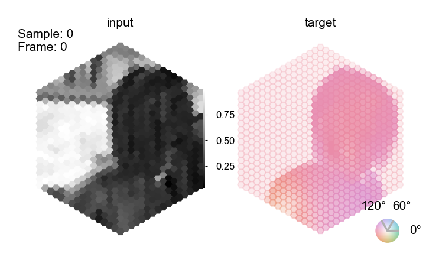
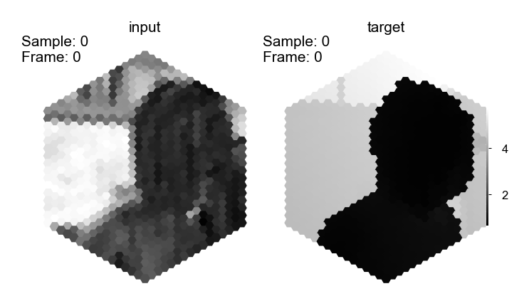
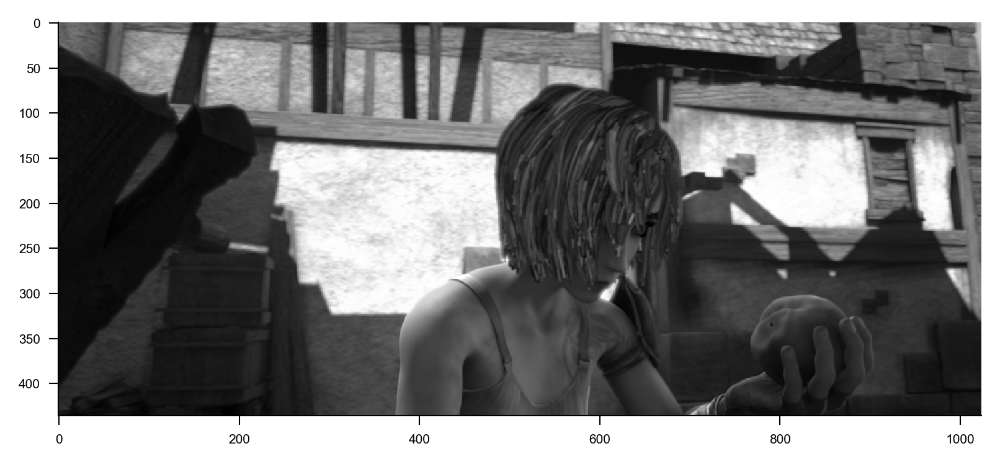
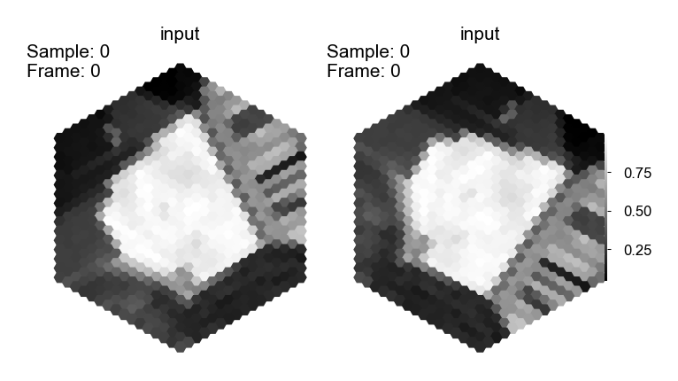
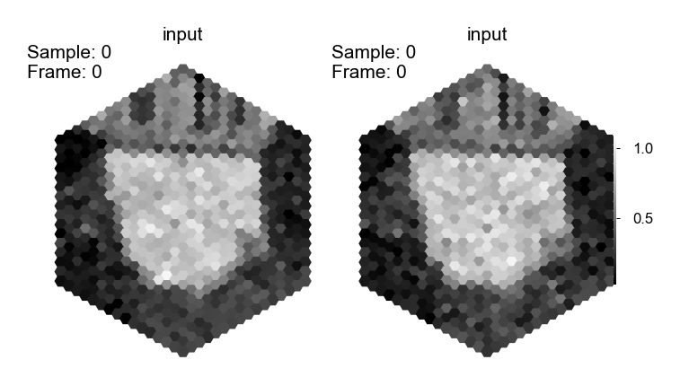
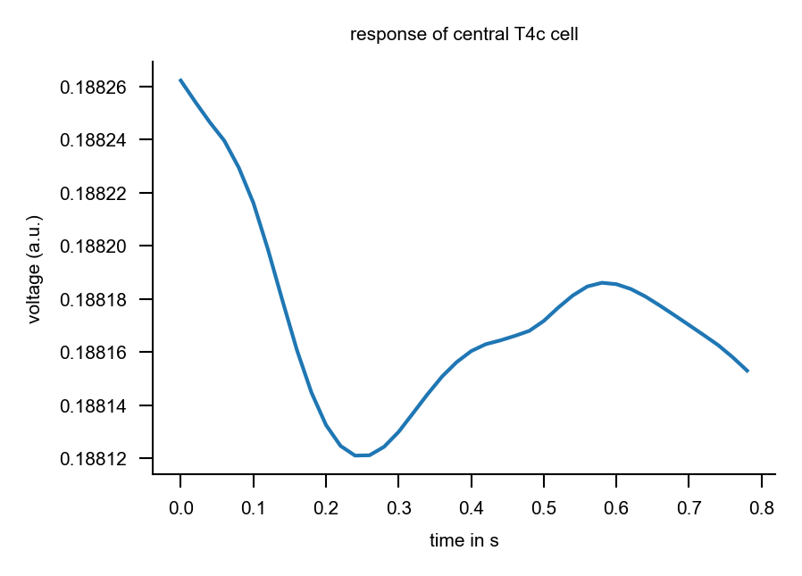
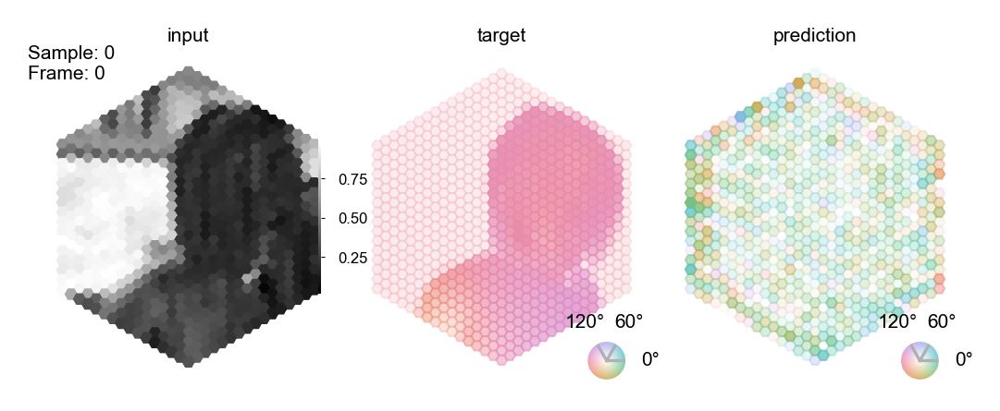
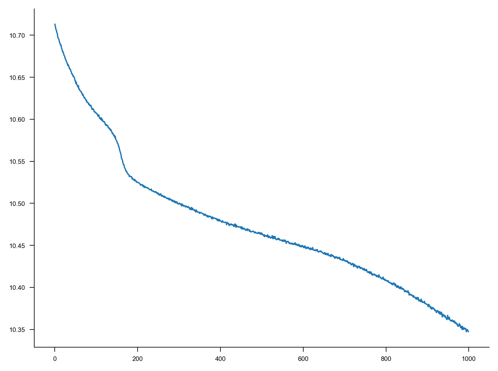
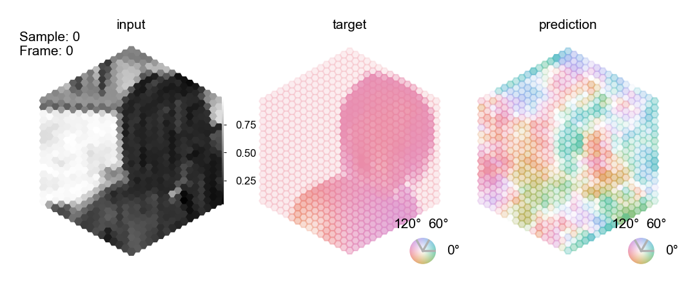

```python
%load_ext autoreload
%autoreload 2

import os

os.environ["TESTING"] = "true"
```

# Optic flow task


This notebook illustrates the optic flow task and how to use it with our pretrained fly visual system model and decoder.


```python
# basic imports
import matplotlib.pyplot as plt
import numpy as np
import torch

plt.rcParams['figure.dpi'] = 200
```

# The Sintel dataset

We use the Sintel dataset to train out models as described in the paper. More infos about the Sintel dataset can be found on the official Sintel website: http://sintel.is.tue.mpg.de/.


```python
import matplotlib.pyplot as plt
import numpy as np
from flyvision.datasets.sintel import MultiTaskSintel
from flyvision.analysis.animations.sintel import SintelSample

%load_ext autoreload
%autoreload 2
```

    The autoreload extension is already loaded. To reload it, use:
      %reload_ext autoreload


The class `MultiTaskSintel` loads, preprocesses, renders, and augments the sintel data. It adheres to the pytorch dataset primitive. It provides the interface to the input data and the output data for the flyvision networks. Note: the fly-eye rendering we use here, we introduce in the notebook on creating custom stimuli already.

This is the full setting:


```python
dataset = MultiTaskSintel(
    tasks=["flow"],
    boxfilter=dict(extent=15, kernel_size=13),
    # Because the fly eye rendering is square
    # and sintel is wide, we can crop sintel
    # in width and render three sequences from one.
    # This allows us to statically augment our dataset
    # a bit already before we proceed with the random augmentations.
    # We end up with 3 * 23 sequences.
    vertical_splits=3,
    n_frames=19,
    center_crop_fraction=0.7,
    dt=1 / 50,
    augment=True,
    # From sequences with more than n_frames, we randomly sample the start frame.
    random_temporal_crop=True,
    all_frames=False,
    # We resample movie frames to the effective framerate given by 1/dt
    resampling=True,
    # We interpolate the flow arrows to 1/dt.
    interpolate=True,
    # We flip with equal probability (using one flip-axis).
    p_flip=0.5,
    flip_axes=[0, 1],
    # We rotate with equal probability (using five fold rotation symmetry of the hex-grid).
    p_rot=5 / 6,
    # We randomly adjust contrast and brightness.
    contrast_std=0.2,
    brightness_std=0.1,
    # We add random white noise pixelweise.
    gaussian_white_noise=0.08,
    gamma_std=None,
    _init_cache=True,
    unittest=False,
)
```


```python
# The `dataset.arg_df` tracks the sequence index, identity etc.
dataset.arg_df
```


<div>
<style scoped>
    .dataframe tbody tr th:only-of-type {
        vertical-align: middle;
    }

    .dataframe tbody tr th {
        vertical-align: top;
    }

    .dataframe thead th {
        text-align: right;
    }
</style>
<table border="1" class="dataframe">
  <thead>
    <tr style="text-align: right;">
      <th></th>
      <th>index</th>
      <th>original_index</th>
      <th>name</th>
      <th>original_n_frames</th>
    </tr>
  </thead>
  <tbody>
    <tr>
      <th>0</th>
      <td>0</td>
      <td>0</td>
      <td>sequence_00_alley_1_split_00</td>
      <td>50</td>
    </tr>
    <tr>
      <th>1</th>
      <td>1</td>
      <td>0</td>
      <td>sequence_00_alley_1_split_01</td>
      <td>50</td>
    </tr>
    <tr>
      <th>2</th>
      <td>2</td>
      <td>0</td>
      <td>sequence_00_alley_1_split_02</td>
      <td>50</td>
    </tr>
    <tr>
      <th>3</th>
      <td>3</td>
      <td>1</td>
      <td>sequence_01_alley_2_split_00</td>
      <td>50</td>
    </tr>
    <tr>
      <th>4</th>
      <td>4</td>
      <td>1</td>
      <td>sequence_01_alley_2_split_01</td>
      <td>50</td>
    </tr>
    <tr>
      <th>...</th>
      <td>...</td>
      <td>...</td>
      <td>...</td>
      <td>...</td>
    </tr>
    <tr>
      <th>64</th>
      <td>64</td>
      <td>21</td>
      <td>sequence_21_temple_2_split_01</td>
      <td>50</td>
    </tr>
    <tr>
      <th>65</th>
      <td>65</td>
      <td>21</td>
      <td>sequence_21_temple_2_split_02</td>
      <td>50</td>
    </tr>
    <tr>
      <th>66</th>
      <td>66</td>
      <td>22</td>
      <td>sequence_22_temple_3_split_00</td>
      <td>50</td>
    </tr>
    <tr>
      <th>67</th>
      <td>67</td>
      <td>22</td>
      <td>sequence_22_temple_3_split_01</td>
      <td>50</td>
    </tr>
    <tr>
      <th>68</th>
      <td>68</td>
      <td>22</td>
      <td>sequence_22_temple_3_split_02</td>
      <td>50</td>
    </tr>
  </tbody>
</table>
<p>69 rows × 4 columns</p>
</div>


## Single sample

First, let's chunk this into smaller digestable pieces.


```python
dataset = MultiTaskSintel(
    tasks=["flow"],
    boxfilter=dict(extent=15, kernel_size=13),
    vertical_splits=1,
    dt=1 / 24,
    augment=False,
)
```

The first sample. For the target, the pixel-accurate motion vectors, the color indicates the direction of motion of the respective input pixel. The saturation indicates the magnitude of motion.


```python
lum = dataset[0]["lum"]
flow = dataset[0]["flow"]

animation = SintelSample(lum[None], flow[None])
animation.animate_in_notebook()
```





Sintel has more groundtruth annotations. We support depth and flow because we know with some confidence that these are relevant for the fly.


```python
dataset = MultiTaskSintel(
    tasks=["depth"],
    boxfilter=dict(extent=15, kernel_size=13),
    vertical_splits=1,
    dt=1 / 24,
    augment=False,
)
```


```python
lum1 = dataset[0]["lum"]
depth1 = dataset[0]["depth"]

animation = SintelSample(lum1[None], depth1[None])
animation.animate_in_notebook()
```





# Augmenting the dataset step-by-step

We apply rich augmentations to the dataset of naturalistic sequences because the dataset is otherwise relatively small. This might lead to overfitting to, e.g., predicting motion mostly into well-represented directons or of objects of specific contrasts etc. Using rich augmentations, we 'ask' the network to generalize better and invariantly compute motion regardless of direction, contrast, brightness, pixel noise, temporal appearance etc.

## Vertical splits

First, we split each sequence into three sequences vertically to leverage a wider extent of the video than if we would only render the center. We precompute these renderings.


```python
from flyvision.analysis.visualization.plots import quick_hex_scatter
```


```python
dataset = MultiTaskSintel(
    tasks=["flow"],
    boxfilter=dict(extent=15, kernel_size=13),
    vertical_splits=3,
    dt=1 / 24,
    augment=False,
)
```

Sintel has 23 movie sequences originally.


```python
len(np.unique(dataset.arg_df.original_index))
```


    23


Each original sequence is 436 pixel in height times 1024 pixel in width in cartesian coordinates.


```python
sequence = dataset.cartesian_sequence(0, vertical_splits=1, center_crop_fraction=1.0)
print(sequence.shape)
```

    (1, 49, 436, 1024)


With the vertical crops, we end up with 3 * 23 sequences. The `dataset.arg_df` tracks the sequence index, identity etc.


```python
dataset.arg_df
```


<div>
<style scoped>
    .dataframe tbody tr th:only-of-type {
        vertical-align: middle;
    }

    .dataframe tbody tr th {
        vertical-align: top;
    }

    .dataframe thead th {
        text-align: right;
    }
</style>
<table border="1" class="dataframe">
  <thead>
    <tr style="text-align: right;">
      <th></th>
      <th>index</th>
      <th>original_index</th>
      <th>name</th>
      <th>original_n_frames</th>
    </tr>
  </thead>
  <tbody>
    <tr>
      <th>0</th>
      <td>0</td>
      <td>0</td>
      <td>sequence_00_alley_1_split_00</td>
      <td>50</td>
    </tr>
    <tr>
      <th>1</th>
      <td>1</td>
      <td>0</td>
      <td>sequence_00_alley_1_split_01</td>
      <td>50</td>
    </tr>
    <tr>
      <th>2</th>
      <td>2</td>
      <td>0</td>
      <td>sequence_00_alley_1_split_02</td>
      <td>50</td>
    </tr>
    <tr>
      <th>3</th>
      <td>3</td>
      <td>1</td>
      <td>sequence_01_alley_2_split_00</td>
      <td>50</td>
    </tr>
    <tr>
      <th>4</th>
      <td>4</td>
      <td>1</td>
      <td>sequence_01_alley_2_split_01</td>
      <td>50</td>
    </tr>
    <tr>
      <th>...</th>
      <td>...</td>
      <td>...</td>
      <td>...</td>
      <td>...</td>
    </tr>
    <tr>
      <th>64</th>
      <td>64</td>
      <td>21</td>
      <td>sequence_21_temple_2_split_01</td>
      <td>50</td>
    </tr>
    <tr>
      <th>65</th>
      <td>65</td>
      <td>21</td>
      <td>sequence_21_temple_2_split_02</td>
      <td>50</td>
    </tr>
    <tr>
      <th>66</th>
      <td>66</td>
      <td>22</td>
      <td>sequence_22_temple_3_split_00</td>
      <td>50</td>
    </tr>
    <tr>
      <th>67</th>
      <td>67</td>
      <td>22</td>
      <td>sequence_22_temple_3_split_01</td>
      <td>50</td>
    </tr>
    <tr>
      <th>68</th>
      <td>68</td>
      <td>22</td>
      <td>sequence_22_temple_3_split_02</td>
      <td>50</td>
    </tr>
  </tbody>
</table>
<p>69 rows × 4 columns</p>
</div>


```python
_ = plt.imshow(sequence[0, 0], cmap=plt.cm.binary_r)
```





```python
fig, axes = plt.subplots(1, 3)
_ = quick_hex_scatter(dataset[0]['lum'][0].flatten(), fig=fig, ax=axes[0], cbar=False)
_ = quick_hex_scatter(dataset[1]['lum'][0].flatten(), fig=fig, ax=axes[1], cbar=False)
_ = quick_hex_scatter(dataset[2]['lum'][0].flatten(), fig=fig, ax=axes[2], cbar=False)
```


## Random temporal crops

We train on 19 frames ~ 792ms movie. Most sequences have 49 frames. To use the whole temporal content, we stochastically sample start and end frame ~ ((1, 19), (2, 20), ..., (31, 49)).


```python
dataset = MultiTaskSintel(
    tasks=["flow"],
    boxfilter=dict(extent=15, kernel_size=13),
    vertical_splits=3,
    n_frames=19,
    dt=1 / 24,
    augment=True,
    random_temporal_crop=True,
    all_frames=False,
    resampling=False,
    interpolate=False,
    p_flip=0,
    p_rot=0,
    contrast_std=None,
    brightness_std=None,
    gaussian_white_noise=None,
)
```


```python
# These two samples from the same original sequence should have stochastically different start and end frames.
lum1 = dataset[0]['lum']
lum2 = dataset[0]['lum']
```


```python
animation = SintelSample(lum1[None], lum2[None], title2="input")
animation.animate_in_notebook()
```


## Flips and rotations

Next, we flip stochastically across 2 axes and or rotate a random number of times around the center. We implement this to be fast to do so at runtime.


```python
dataset = MultiTaskSintel(
    tasks=["flow"],
    boxfilter=dict(extent=15, kernel_size=13),
    vertical_splits=3,
    n_frames=19,
    dt=1 / 24,
    augment=True,
    random_temporal_crop=False,
    all_frames=False,
    resampling=False,
    interpolate=False,
    p_flip=1 / 2,
    p_rot=5 / 6,
    contrast_std=None,
    brightness_std=None,
    gaussian_white_noise=None,
)
```


```python
# These two samples from the same original sequence should have stochastically different orientation.
lum1 = dataset[0]['lum']
lum2 = dataset[0]['lum']
```


```python
animation = SintelSample(lum1[None], lum2[None], title2="input")
animation.animate_in_notebook()
```





Flow vectors need to be flipped and rotated accordingly.


```python
# These two samples from the same original sequence should have stochastically different orientation.
data = dataset[0]
lum1 = data['lum']
flow1 = data['flow']
```


```python
animation = SintelSample(lum1[None], flow1[None])
animation.animate_in_notebook()
```


## Further augmentations

Besides that, we also augment the input with random contrasts and brightnesses and random gaussian pixel noise, while the motion stays the same. This pretends that the same motion takes place under different illumination conditions and signal to noise ratios.


```python
dataset = MultiTaskSintel(
    tasks=["flow"],
    boxfilter=dict(extent=15, kernel_size=13),
    vertical_splits=3,
    n_frames=19,
    dt=1 / 24,
    augment=True,
    random_temporal_crop=False,
    all_frames=False,
    resampling=False,
    interpolate=False,
    p_flip=0,
    p_rot=0,
    contrast_std=0.2,
    brightness_std=0.1,
    gaussian_white_noise=0.08,
)
```


```python
# These two samples from the same original sequence have
# stochastically different contrast, brightness and pixel-wise noise.
lum1 = dataset[0]['lum']
lum2 = dataset[0]['lum']
```


```python
animation = SintelSample(lum1[None], lum2[None], title2="input")
animation.animate_in_notebook()
```





# Framerate of the dataset and integration time step

The Sintel dataset is originally rendered at 24 frames per second, i.e., one frame every 42ms. The fruit fly neurons are able to respond to temporal differences as fast as 5-20ms. Therefore, we resample every frame multiple times to pretend that the movie was originally sampled at such a faster framerate. For the motion fields, we interpolate flow vectors in time instead of resampling them, which hopefully gives a better learning signal to the network. We have to trade-off speed of the numerical integration and memory consumption during optimization with the simulation accuracy by choosing time steps between 5-20ms. We chose to train networks at the upper bount of 20ms and evaluate them more accurately at 5-10ms.


```python
dataset = MultiTaskSintel(
    tasks=["flow"],
    boxfilter=dict(extent=15, kernel_size=13),
    vertical_splits=3,
    n_frames=19,
    dt=1 / 50,
    augment=False,
    resampling=True,
    interpolate=True,
)
```


```python
# Now, every input frame appears twice and target frames are interpolated.
data = dataset[0]
lum1 = data['lum']
flow1 = data['flow']
```


```python
animation = SintelSample(lum1[None], flow1[None])
animation.animate_in_notebook()
```


# Computing responses to the Sintel data

Before we get to training a network, we look at a few responses to these type of sequences of individual neurons.


```python
from flyvision.network import NetworkView, Network
from flyvision.utils.activity_utils import LayerActivity

from flyvision.datasets.sintel import MultiTaskSintel
```


```python
# new network instance
network = Network()

# Alternative: uncomment to use a pretrained network
# network_view = NetworkView(results_dir / "flow/0000/000")
# network = network_view.init_network(network)
```

    [2024-10-14 20:56:54] network:222 Initialized network with NumberOfParams(free=734, fixed=2959) parameters.


```python
layer_activity = LayerActivity(None, network.connectome, keepref=True)
```


```python
dataset = MultiTaskSintel(
    tasks=["flow"],
    boxfilter=dict(extent=15, kernel_size=13),
    vertical_splits=1,
    n_frames=19,
    dt=1 / 50,
    augment=False,
    resampling=True,
    interpolate=True,
)
```


```python
stationary_state = network.fade_in_state(1.0, dataset.dt, dataset[0]["lum"][[0]])
responses = network.simulate(
    dataset[0]["lum"][None], dataset.dt, initial_state=stationary_state
).cpu()
```


```python
plt.figure(figsize=[3, 2])
layer_activity.update(responses)
r = layer_activity.central.T4c.squeeze().numpy()
time = np.arange(0, r.shape[0], 1) * dataset.dt
plt.plot(time, r)
plt.xlabel("time in s")
plt.ylabel("voltage (a.u.)")
plt.title("response of central T4c cell")
```


    Text(0.5, 1.0, 'response of central T4c cell')





# Decoding the task from neural activity

We need to predict the pixel-accurate flow field that Sintel gives us. For that we decode the voltages of a bunch of cell types. The decoder and the network are trained end-to-end. Here an example of a forward pass through the whole pipeline in code.


```python
from flyvision.datasets.sintel import MultiTaskSintel
from flyvision.task.decoder import DecoderGAVP
```


```python
network = Network()
```

    [2024-10-14 20:57:10] network:222 Initialized network with NumberOfParams(free=734, fixed=2959) parameters.


```python
decoder = DecoderGAVP(network.connectome, shape=[8, 2], kernel_size=5)
```

    [2024-10-14 20:57:15] decoder:282 Initialized decoder with NumberOfParams(free=7427, fixed=0) parameters.
    [2024-10-14 20:57:15] decoder:283 DecoderGAVP(
      (base): Sequential(
        (0): Conv2dHexSpace(34, 8, kernel_size=(5, 5), stride=(1, 1), padding=(2, 2))
        (1): BatchNorm2d(8, eps=1e-05, momentum=0.1, affine=True, track_running_stats=True)
        (2): Softplus(beta=1, threshold=20)
        (3): Dropout(p=0.5, inplace=False)
      )
      (decoder): Sequential(
        (0): Conv2dHexSpace(8, 3, kernel_size=(5, 5), stride=(1, 1), padding=(2, 2))
      )
      (head): Sequential()
    )


```python
dataset = MultiTaskSintel(
    tasks=["flow"],
    boxfilter=dict(extent=15, kernel_size=13),
    vertical_splits=1,
    all_frames=True,
    dt=1 / 50,
    augment=False,
    resampling=True,
    interpolate=True,
)
```


```python
data = dataset[0]
lum = data["lum"]
flow = data["flow"]

stationary_state = network.fade_in_state(1.0, dataset.dt, lum[[0]])
responses = network.simulate(lum[None], dataset.dt, initial_state=stationary_state)
```


```python
y_pred = decoder(responses)
```

We predict motion with an untrained decoder from an untrained network with randomly initialized parameters.
We do not expect this to work.


```python
animation = SintelSample(lum[None], flow[None], prediction=y_pred.detach().cpu())
animation.animate_in_notebook(frames=np.arange(lum.shape[0])[::10])
```





```python
((y_pred - flow) ** 2).sqrt().mean()
```


    tensor(0.9801, device='cuda:0', grad_fn=<MeanBackward0>)


# Training network and decoder on a single batch

We now train the network on a single batch to validate that the pipeline works. We do not expect these networks to generalize their function.


```python
from tqdm.notebook import tqdm
from torch.optim import Adam
from torch.utils.data import DataLoader

from flyvision.network import Network
from flyvision.task.decoder import DecoderGAVP

from flyvision.datasets.sintel import MultiTaskSintel
from flyvision.task.objectives import l2norm, epe
```


```python
network = Network()
```

    [2024-10-14 20:57:31] network:222 Initialized network with NumberOfParams(free=734, fixed=2959) parameters.


```python
decoder = DecoderGAVP(network.connectome, shape=[8, 2], kernel_size=5)
```

    [2024-10-14 20:57:36] decoder:282 Initialized decoder with NumberOfParams(free=7427, fixed=0) parameters.
    [2024-10-14 20:57:36] decoder:283 DecoderGAVP(
      (base): Sequential(
        (0): Conv2dHexSpace(34, 8, kernel_size=(5, 5), stride=(1, 1), padding=(2, 2))
        (1): BatchNorm2d(8, eps=1e-05, momentum=0.1, affine=True, track_running_stats=True)
        (2): Softplus(beta=1, threshold=20)
        (3): Dropout(p=0.5, inplace=False)
      )
      (decoder): Sequential(
        (0): Conv2dHexSpace(8, 3, kernel_size=(5, 5), stride=(1, 1), padding=(2, 2))
      )
      (head): Sequential()
    )


```python
dataset = MultiTaskSintel(
    tasks=["flow"],
    boxfilter=dict(extent=15, kernel_size=13),
    vertical_splits=1,
    n_frames=19,
    dt=1 / 50,
    augment=False,
    resampling=True,
    interpolate=True,
)
```


```python
t_pre = 0.5
dt = 1 / 50
batch_size = 4
train_loader = DataLoader(dataset, batch_size=batch_size)
```


```python
optimizer = Adam((*network.parameters(), *decoder.parameters()), lr=1e-5)
```


```python
batch = next(iter(train_loader))
```


```python
loss_fn = epe
```


```python
epochs = 1000

errors = []

initial_state = network.steady_state(t_pre, dt, batch_size)

for e in tqdm(range(epochs)):
    lum = batch["lum"]
    flow = batch["flow"]

    optimizer.zero_grad()
    network.stimulus.zero()
    network.stimulus.add_input(lum)

    activity = network(network.stimulus(), dt=1 / 50, state=initial_state)
    y_pred = decoder(activity)

    batch_error = loss_fn(y_pred, flow)
    errors.append(batch_error.cpu().item())
    batch_error.backward()
    optimizer.step()

    if e % 10 == 0:
        print(f"Epoch {e}: {batch_error.item()}")
```


      0%|          | 0/1000 [00:00<?, ?it/s]


    Epoch 0: 10.713071823120117
    Epoch 10: 10.694902420043945
    Epoch 20: 10.680363655090332
    Epoch 30: 10.666953086853027
    Epoch 40: 10.656447410583496
    Epoch 50: 10.645711898803711
    Epoch 60: 10.63460636138916
    Epoch 70: 10.62692642211914
    Epoch 80: 10.619820594787598
    Epoch 90: 10.611517906188965
    Epoch 100: 10.607583045959473
    Epoch 110: 10.601799964904785
    Epoch 120: 10.597103118896484
    Epoch 130: 10.589568138122559
    Epoch 140: 10.583572387695312
    Epoch 150: 10.573358535766602
    Epoch 160: 10.557780265808105
    Epoch 170: 10.541166305541992
    Epoch 180: 10.5318603515625
    Epoch 190: 10.528465270996094
    Epoch 200: 10.524687767028809
    Epoch 210: 10.522351264953613
    Epoch 220: 10.519081115722656
    Epoch 230: 10.51638412475586
    Epoch 240: 10.513705253601074
    Epoch 250: 10.510396957397461
    Epoch 260: 10.509458541870117
    Epoch 270: 10.505942344665527
    Epoch 280: 10.504344940185547
    Epoch 290: 10.500924110412598
    Epoch 300: 10.499275207519531
    Epoch 310: 10.497615814208984
    Epoch 320: 10.495290756225586
    Epoch 330: 10.495119094848633
    Epoch 340: 10.489775657653809
    Epoch 350: 10.48803997039795
    Epoch 360: 10.486355781555176
    Epoch 370: 10.485116958618164
    Epoch 380: 10.482747077941895
    Epoch 390: 10.482059478759766
    Epoch 400: 10.478900909423828
    Epoch 410: 10.47703742980957
    Epoch 420: 10.475617408752441
    Epoch 430: 10.47423267364502
    Epoch 440: 10.472049713134766
    Epoch 450: 10.471711158752441
    Epoch 460: 10.46876049041748
    Epoch 470: 10.466737747192383
    Epoch 480: 10.466827392578125
    Epoch 490: 10.46402359008789
    Epoch 500: 10.464691162109375
    Epoch 510: 10.46159553527832
    Epoch 520: 10.460050582885742
    Epoch 530: 10.460445404052734
    Epoch 540: 10.458453178405762
    Epoch 550: 10.456347465515137
    Epoch 560: 10.454182624816895
    Epoch 570: 10.452312469482422
    Epoch 580: 10.451105117797852
    Epoch 590: 10.449974060058594
    Epoch 600: 10.449149131774902
    Epoch 610: 10.447746276855469
    Epoch 620: 10.445918083190918
    Epoch 630: 10.444019317626953
    Epoch 640: 10.442822456359863
    Epoch 650: 10.440664291381836
    Epoch 660: 10.440509796142578
    Epoch 670: 10.437874794006348
    Epoch 680: 10.436468124389648
    Epoch 690: 10.434030532836914
    Epoch 700: 10.432242393493652
    Epoch 710: 10.429919242858887
    Epoch 720: 10.428377151489258
    Epoch 730: 10.425311088562012
    Epoch 740: 10.422719955444336
    Epoch 750: 10.421255111694336
    Epoch 760: 10.418807029724121
    Epoch 770: 10.415323257446289
    Epoch 780: 10.412861824035645
    Epoch 790: 10.40996265411377
    Epoch 800: 10.408342361450195
    Epoch 810: 10.405858993530273
    Epoch 820: 10.403818130493164
    Epoch 830: 10.40142822265625
    Epoch 840: 10.397943496704102
    Epoch 850: 10.394493103027344
    Epoch 860: 10.390817642211914
    Epoch 870: 10.38827133178711
    Epoch 880: 10.383781433105469
    Epoch 890: 10.382647514343262
    Epoch 900: 10.379199981689453
    Epoch 910: 10.374433517456055
    Epoch 920: 10.372457504272461
    Epoch 930: 10.37112045288086
    Epoch 940: 10.366717338562012
    Epoch 950: 10.36235237121582
    Epoch 960: 10.36122989654541
    Epoch 970: 10.356871604919434
    Epoch 980: 10.3525390625
    Epoch 990: 10.351277351379395


```python
plt.plot(errors)
```


    [<matplotlib.lines.Line2D at 0x7f15bb12f8b0>]





We expect that the prediction from this overfitted network on the sample it was trained on is ok.


```python
data = dataset[0]
lum = data["lum"]
flow = data["flow"]

stationary_state = network.fade_in_state(1.0, dataset.dt, lum[[0]])
responses = network.simulate(lum[None], dataset.dt, initial_state=stationary_state)
```


```python
y_pred = decoder(responses)
```


```python
animation = SintelSample(lum[None], flow[None], prediction=y_pred.detach().cpu())
animation.animate_in_notebook()
```


```python
((y_pred - flow) ** 2).sqrt().mean()
```


    tensor(0.7608, device='cuda:0', grad_fn=<MeanBackward0>)


# Evaluating trained networks


```python
from flyvision import results_dir
from flyvision.network import NetworkView
from flyvision.utils.activity_utils import LayerActivity

from flyvision.datasets.sintel import MultiTaskSintel
from flyvision.task.decoder import DecoderGAVP
```


```python
# we load the best task-performing model from the presorted ensemble
network_view = NetworkView(results_dir / "flow/0000/000")
```

    [2024-10-14 20:59:36] network_view:125 Initialized network view at /groups/turaga/home/lappalainenj/FlyVis/private/flyvision/data/results/flow/0000/000


```python
network = network_view.init_network()
```

    [2024-10-14 20:59:44] network:222 Initialized network with NumberOfParams(free=734, fixed=2959) parameters.
    [2024-10-14 20:59:44] chkpt_utils:35 Recovered network state.


```python
network_view.dir.config.task.decoder
```


    Namespace(
      flow = Namespace(
        type = 'DecoderGAVP',
        shape = [8, 2],
        kernel_size = 5,
        const_weight = 0.001,
        n_out_features = None,
        p_dropout = 0.5
      )
    )


```python
decoder = network_view.init_decoder()["flow"]
```

    [2024-10-14 20:59:49] decoder:282 Initialized decoder with NumberOfParams(free=7427, fixed=0) parameters.
    [2024-10-14 20:59:49] decoder:283 DecoderGAVP(
      (base): Sequential(
        (0): Conv2dHexSpace(34, 8, kernel_size=(5, 5), stride=(1, 1), padding=(2, 2))
        (1): BatchNorm2d(8, eps=1e-05, momentum=0.1, affine=True, track_running_stats=True)
        (2): Softplus(beta=1, threshold=20)
        (3): Dropout(p=0.5, inplace=False)
      )
      (decoder): Sequential(
        (0): Conv2dHexSpace(8, 3, kernel_size=(5, 5), stride=(1, 1), padding=(2, 2))
      )
      (head): Sequential()
    )
    [2024-10-14 20:59:49] chkpt_utils:64 Recovered flow decoder state.


```python
dataset = MultiTaskSintel(
    tasks=["flow"],
    boxfilter=dict(extent=15, kernel_size=13),
    vertical_splits=1,
    all_frames=False,
    n_frames=19,
    dt=1 / 50,
    augment=False,
    resampling=True,
    interpolate=True,
)
```


```python
data = [dataset[i] for i in range(4)]
lum = torch.stack([d["lum"] for d in data])
flow = torch.stack([d["flow"] for d in data])

stationary_state = network.fade_in_state(1.0, dataset.dt, lum[:, 0])
responses = network.simulate(lum, dataset.dt, initial_state=stationary_state)
```


```python
y_pred = decoder(responses)
```

We expect this network to generalize across sequences. This network sees motion into all directions.


```python
animation = SintelSample(lum, flow, prediction=y_pred.detach().cpu())
animation.animate_in_notebook()
```





We expect the accuracy is not as good as the overfitted example because this network generalized across the whole-dataset.


```python
((y_pred - flow) ** 2).sqrt().mean()
```


    tensor(6.4105, device='cuda:0', grad_fn=<MeanBackward0>)


# Evaluating ensembles

Last, we evaluated the task error of the 50 trained networks on a held out set of sequences. We evaluated the task error across all checkpoints during training and show the minimal one in the histrogram below. This checkpoint we analyse with respect to it's tuning predictions as shown in the next notebooks.


```python
from flyvision import EnsembleView
```


```python
ensemble = EnsembleView("flow/0000")
```


    Loading ensemble:   0%|          | 0/50 [00:00<?, ?it/s]


    [2024-10-14 21:00:15] ensemble:166 Loaded 50 networks.


```python
ensemble.task_error_histogram()
```


    (<Figure size 300x300 with 1 Axes>,
     <Axes: xlabel='task error', ylabel='number models'>)


